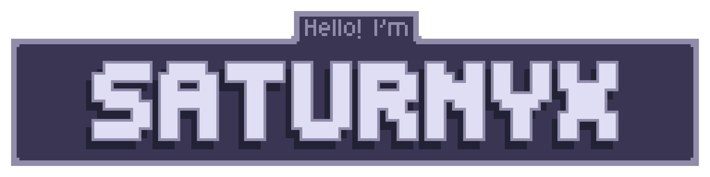
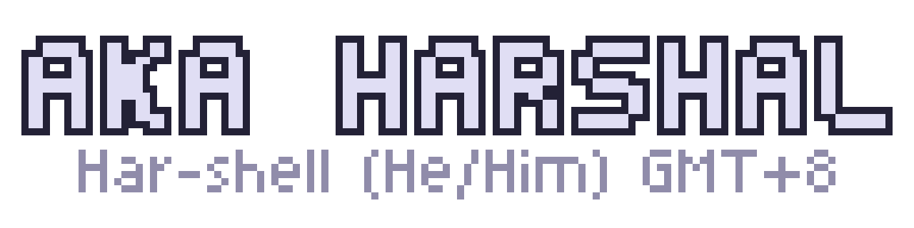
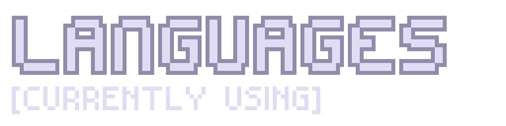
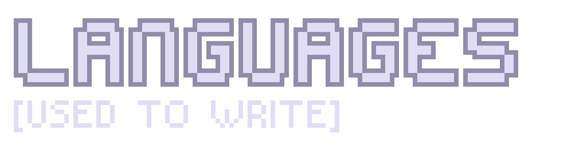
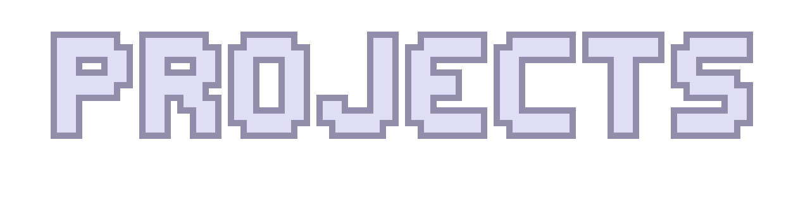
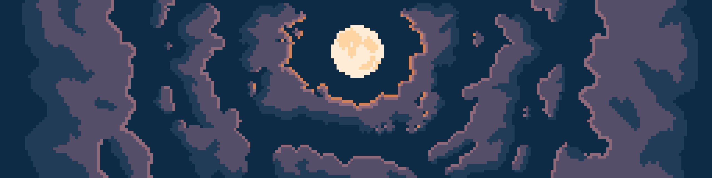

  
   
  
   
  <em>Har-shell (He/Him)</em>
   
  🕗 GMT+8

 

  

  

## Passion

<!-- Vex Robotics (Team 8059Z as of 2026) -->
- Vex Robotics
- Creating random stuff (Websites, Programmes, etc.)

  

- [Curator](https://github.com/Saturnyx/curator)
- [KeyItems](https://modrinth.com/mod/keyitems)

## Stats

## Contacting me
If you need to contact me privately, email <saturnyx@disroot.org>. Please rememeber that it will take a few hours to days for me to respond, depending on my availability.

  

<!---
Harshal-ACSI/Harshal-ACSI is a ✨ special ✨ repository because its `README.md` (this file) appears on your GitHub profile.
You can click the Preview link to take a look at your changes.
--->
